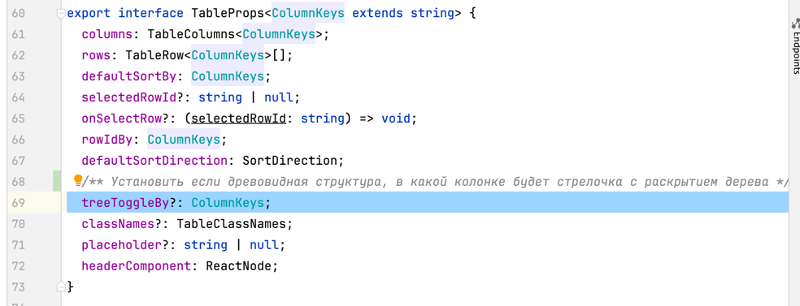
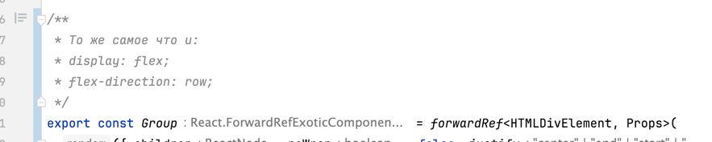

## Storybook:

**Запуск сторибука:**

`yarn run storybook`

**Правило обновления сторибука:**

1. При добавлении нового компонента или изменения существующего
   в `@/shared/ui` необходимо создавать/обновлять стори
2. Если не очевидно что означает пропс, необходимо добавлять описание. Если очевидно что означает пропс - добавлять описание не надо.
   Описание автоматически появится в storybook.

Например добавлено описание для пропса `treeToggleBy`: 
 3. Если не очевидно зачем нужен компонент, можно добавить описание.

Например описание для компонента `Group`: 
 4. Если внутри компонента используется redux store или другие side компоненты, нужно использовать или добавлять новые helpers (в основном decorators) в `@/shared/storybook` 5. Все новые иконки нужно добавлять в `@/shared/assets/Iconography.mdx` 6. Если компонент имеет несколько сложных состояний, нужно описывать их в отдельных Story чтобы разработчикам было понят.

Например для компонента DiagramContainer было описано 2 стори: С таблицей и с bar charts. 
